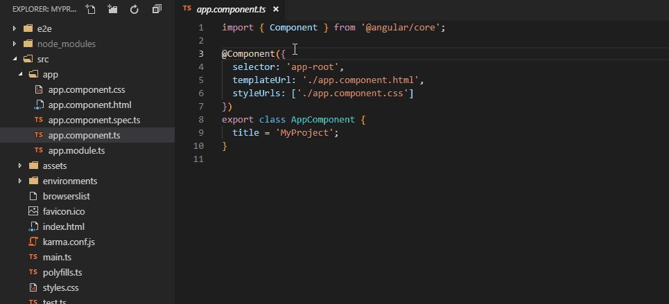
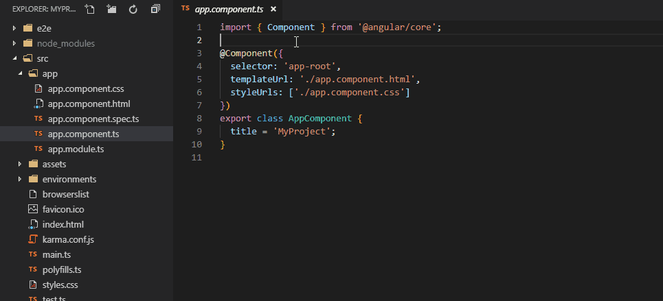
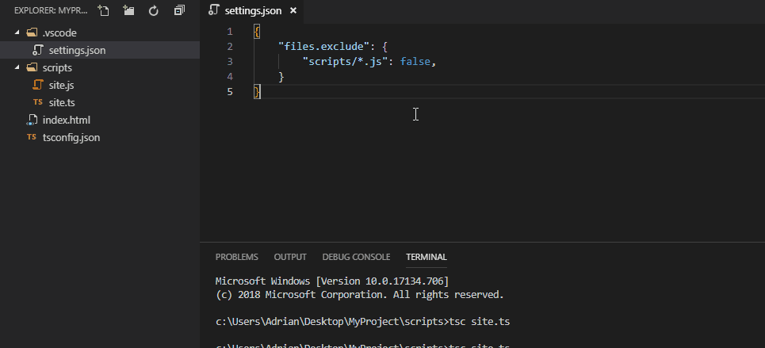

# Switcher

Switch between associated files using keybindings, context menu or command palette. Configured out of box to work with Angular, Razor Pages, TypeScript, Sass and minified JS or CSS files.

Jump between:
- Angular components, templates, stylesheets and tests,
- TypeScript source code and transpiled JavaScript,
- Razor Page and it's Page Model,
- CSS files and their minified equivalents...

## See how it works





> Tip: You can access hidden/excluded files using `Go to...` command available through explorer's context menu.



## Default Keybindings

| Key     | Command                    |
|-------  |---                         |
| Alt + i | Go to Component            |
| Alt + o | Go to Template             |
| Alt + p | Go to Stylesheet           |
| Alt + [ | Go to Test                 |
| Alt + i | Go to System Under Test    |
| Alt + ] | Go to...                   |

## Extension Settings

You can configure extension using `switcher.associations` property in settings file. Use IntelliSense to discover supported values.

### Default Configuration
```json
    "switcher.associations": [
        {
            "extension": ".component.ts",
            "associated": {
                "template": [
                    ".component.html"
                ],
                "stylesheet": [
                    ".component.css",
                    ".component.scss",
                    ".component.sass",
                    ".component.less"
                ],
                "test": [
                    ".component.spec.ts"
                ]
            }
        },
        {
            "extension": ".component.spec.ts",
            "associated": {
                "component": [
                    ".component.ts"
                ],
                "template": [
                    ".component.html"
                ],
                "stylesheet": [
                    ".component.css",
                    ".component.scss",
                    ".component.sass",
                    ".component.less"
                ]
            }
        },
        {
            "extension": ".component.html",
            "associated": {
                "component": [
                    ".component.ts"
                ],
                "stylesheet": [
                    ".component.css",
                    ".component.scss",
                    ".component.sass",
                    ".component.less"
                ],
                "test": [
                    ".component.spec.ts"
                ]
            }
        },
        {
            "extension": ".component.css",
            "associated": {
                "component": [
                    ".component.ts"
                ],
                "template": [
                    ".component.html"
                ],
                "test": [
                    ".component.spec.ts"
                ]
            }
        },
        {
            "extension": ".component.scss",
            "associated": {
                "component": [
                    ".component.ts"
                ],
                "template": [
                    ".component.html"
                ],
                "test": [
                    ".component.spec.ts"
                ]
            }
        },
        {
            "extension": ".component.sass",
            "associated": {
                "component": [
                    ".component.ts"
                ],
                "template": [
                    ".component.html"
                ],
                "test": [
                    ".component.spec.ts"
                ]
            }
        },
        {
            "extension": ".component.less",
            "associated": {
                "component": [
                    ".component.ts"
                ],
                "template": [
                    ".component.html"
                ],
                "test": [
                    ".component.spec.ts"
                ]
            }
        },
        {
            "extension": ".spec.ts",
            "associated": {
                "sut": [
                    ".ts"
                ]
            }
        },
        {
            "extension": ".ts",
            "associated": {
                "compiled": [
                    ".js"
                ],
                "minified": [
                    ".min.js"
                ],
                "test": [
                    ".spec.ts"
                ]
            }
        },
        {
            "extension": ".min.js",
            "associated": {
                "source": [
                    ".ts",
                    ".js"
                ]
            }
        },
        {
            "extension": ".js",
            "associated": {
                "source": [
                    ".ts"
                ],
                "minified": [
                    ".min.js"
                ]
            }
        },
        {
            "extension": ".min.css",
            "associated": {
                "source": [
                    ".scss",
                    ".sass",
                    ".less",
                    ".css"
                ]
            }
        },
        {
            "extension": ".css",
            "associated": {
                "source": [
                    ".scss",
                    ".sass",
                    ".less"
                ],
                "minified": [
                    ".min.css"
                ]
            }
        },
        {
            "extension": ".scss",
            "associated": {
                "compiled": [
                    ".css"
                ],
                "minified": [
                    ".min.css"
                ]
            }
        },
        {
            "extension": ".sass",
            "associated": {
                "compiled": [
                    ".css"
                ],
                "minified": [
                    ".min.css"
                ]
            }
        },
        {
            "extension": ".less",
            "associated": {
                "compiled": [
                    ".css"
                ],
                "minified": [
                    ".min.css"
                ]
            }
        },
        {
            "extension": ".cshtml",
            "associated": {
                "model": [
                    ".cshtml.cs"
                ]
            }
        },
        {
            "extension": ".cshtml.cs",
            "associated": {
                "page": [
                    ".cshtml"
                ]
            }
        }
    ]
```